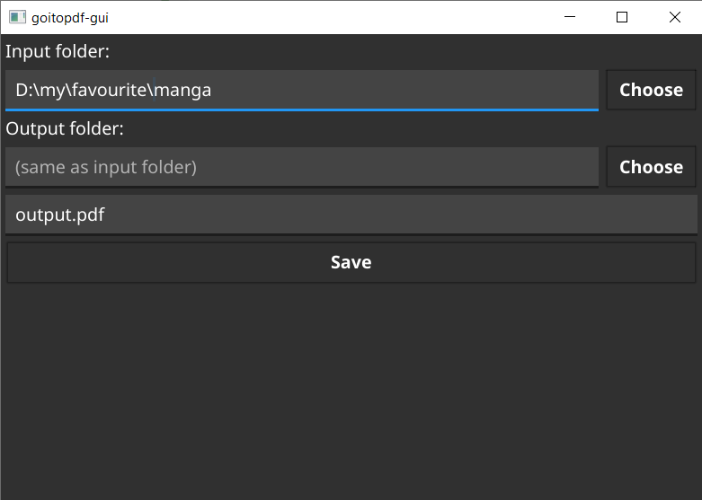

# Goitopdf GUI

Graphical interface for [goitopdf](https://github.com/br3w0r/goitopdf) - a cli tool for converting images to pdf.

Just pick a directory, enter output directory or leave empty to save the output file to input directory, and enter a name for the output file.

Keep Going ;)



## Installation

### Windows

Binaries for windows are coming soon.

### Linux

Binaries for linux are coming soon.

## Build from source

### On windows

The easiest way is to install [TDM-GCC](https://jmeubank.github.io/tdm-gcc/download/) and then run the following commands (make shure that you have git installed):

```powershell
> git clone https://github.com/br3w0r/goitopdf-gui.git
> cd goitopdf-gui
> go download
> go build -o ./goitopdf-gui.exe
```

### On linux

Set up a build environment as follows in linux section of [Fyne Getting Started guide](https://developer.fyne.io/started/) and then get and build from source (make shure you have git installed):

```bash
$ git clone https://github.com/br3w0r/goitopdf-gui.git
$ cd goitopdf-gui
$ go download
$ go build -o ./goitopdf-gui.exe
```

## License

The software is released under GNU GPL-3.0
